<!-- _class: title --->

# Presentación 11: Corrección de Beamformers y nuevo entrenamiento solo para CPWC

Sebastián Gutiérrez Milla

---

# Compressing Beamforming (Antes Sparse Regularization)

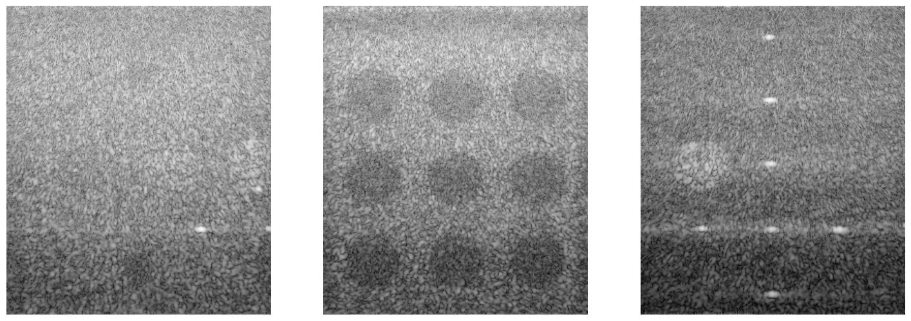 

---
# F-DMAS Corrección

| F-DMAS Paper | F-DMAS propio |
| :---: | :---: |
| 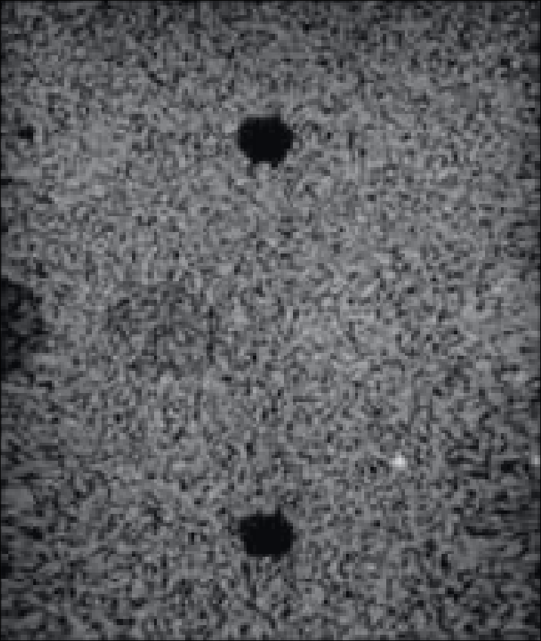 | 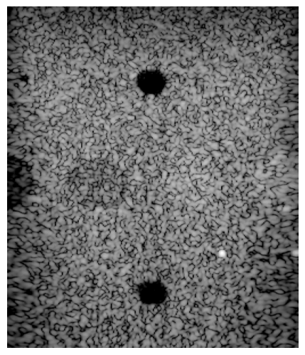 |

---
# CV Corrección

| CV Paper | CV propio |
| :---: | :---: |
| 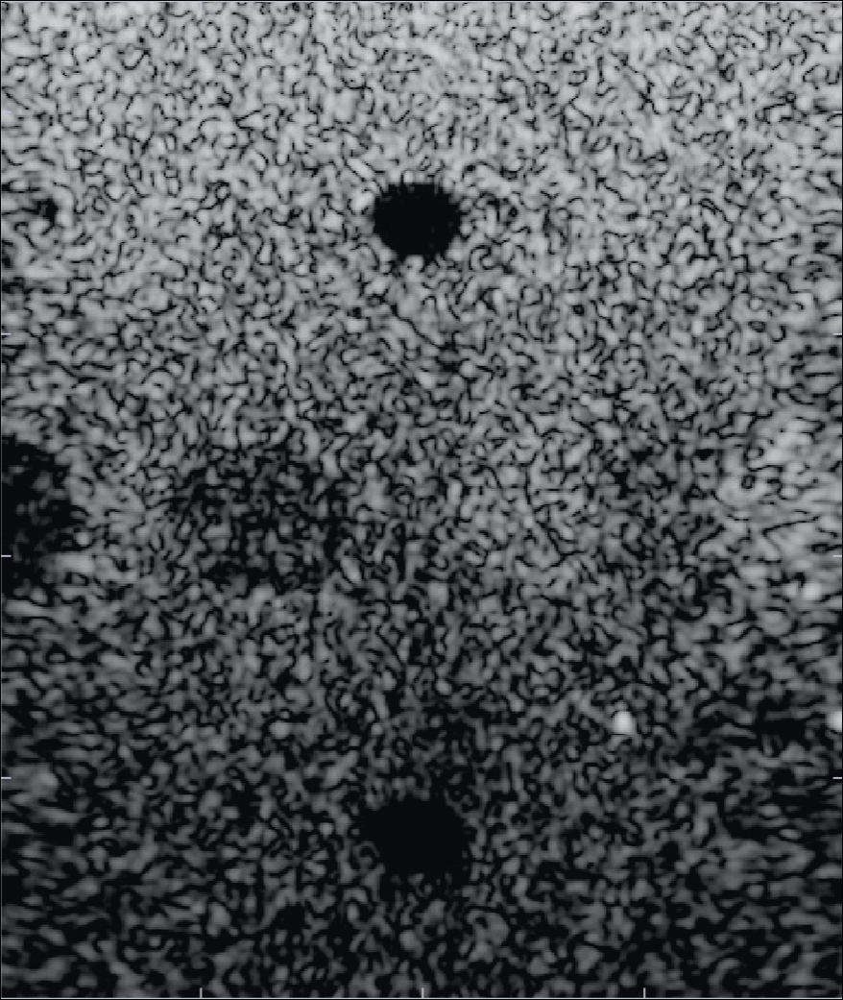 | 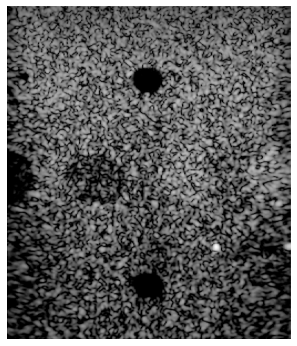 |

---
# iMAP Corrección

| iMAP Paper | iMAP propio |
| :---: | :---: |
| 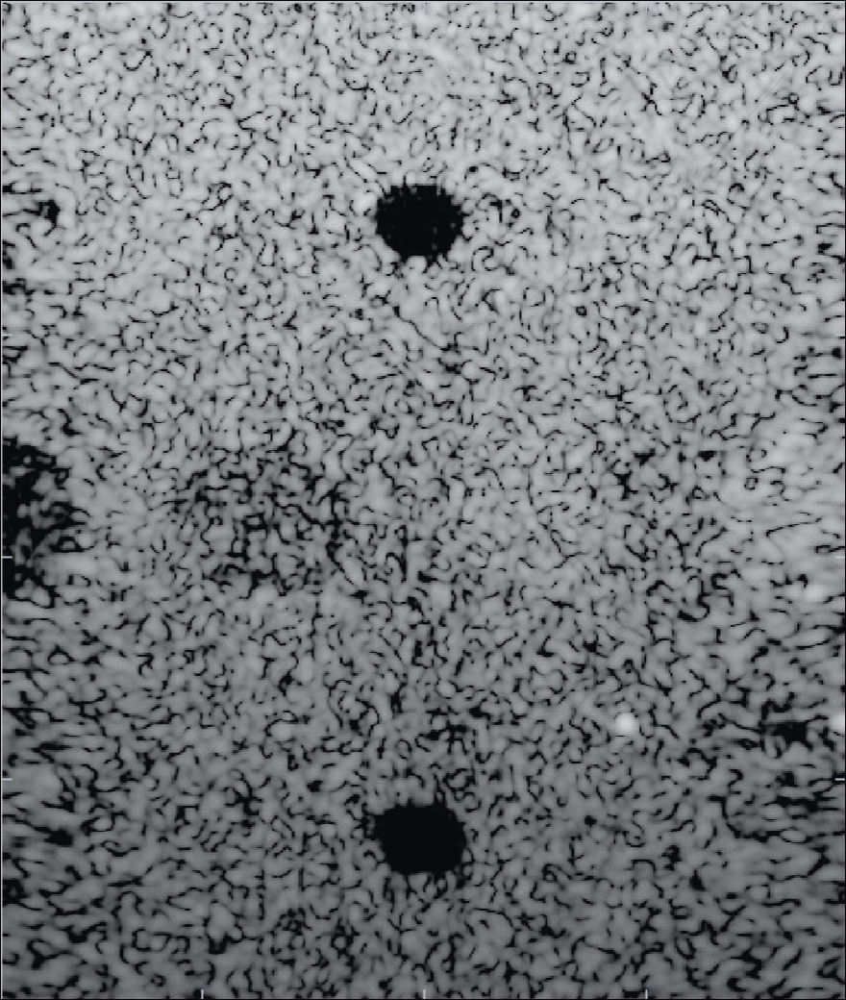 | 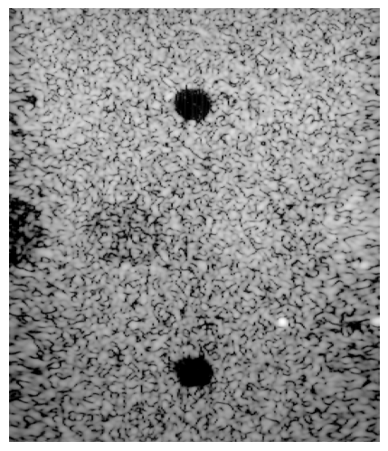 |

---
# MV Corrección

| MV Paper | MV propio |
| :---: | :---: |
| 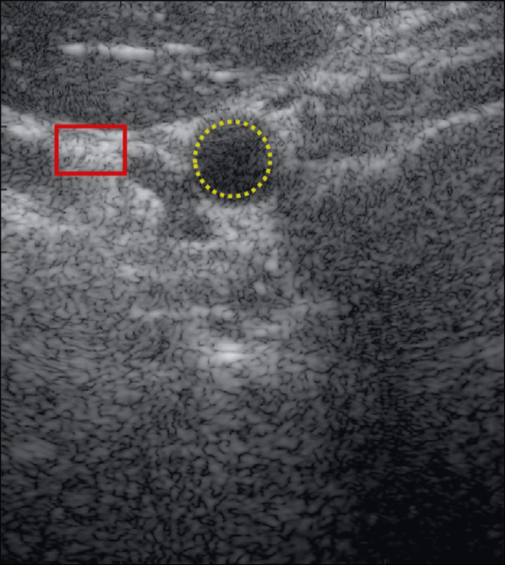 | 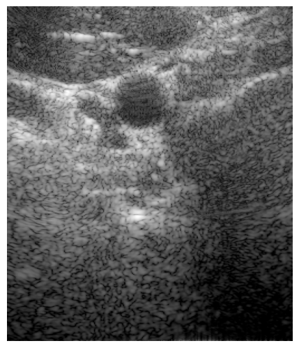 |

---

# contrast_speckle_expe_dataset_rf: Ground Truths Central Angle

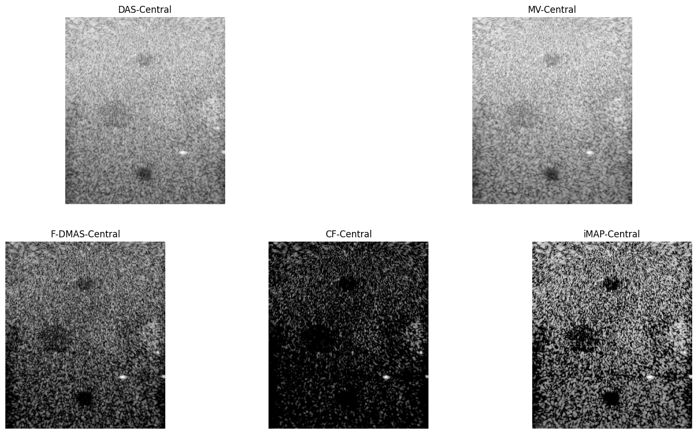

---

# contrast_speckle_expe_dataset_rf: Ground Truths CPWC

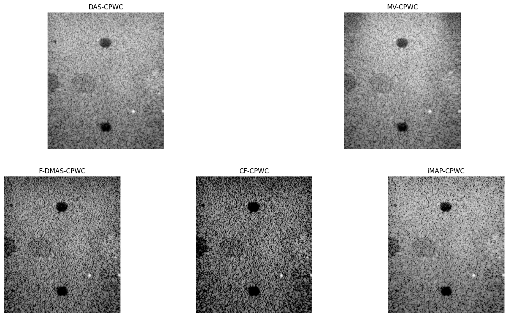

---

# contrast_speckle_simu_dataset_rf: Ground Truths Central Angle

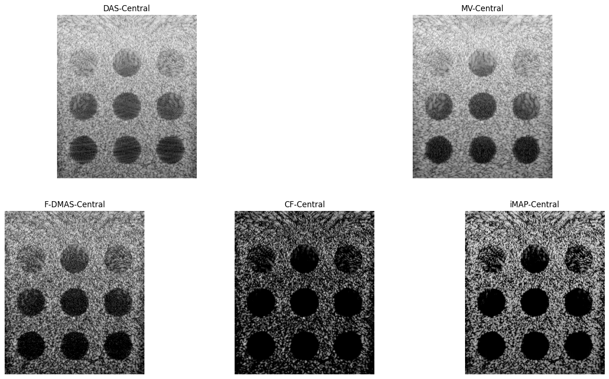

---

# contrast_speckle_simu_dataset_rf: Ground Truths CPWC

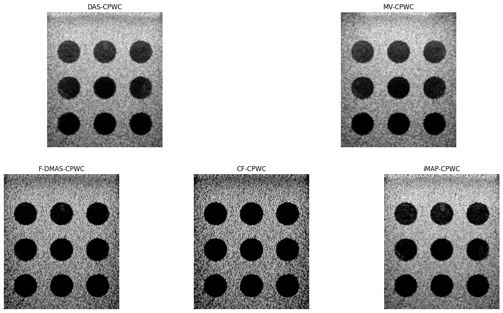

---

# contrast_speckle_expe_dataset_rf: Models showcase

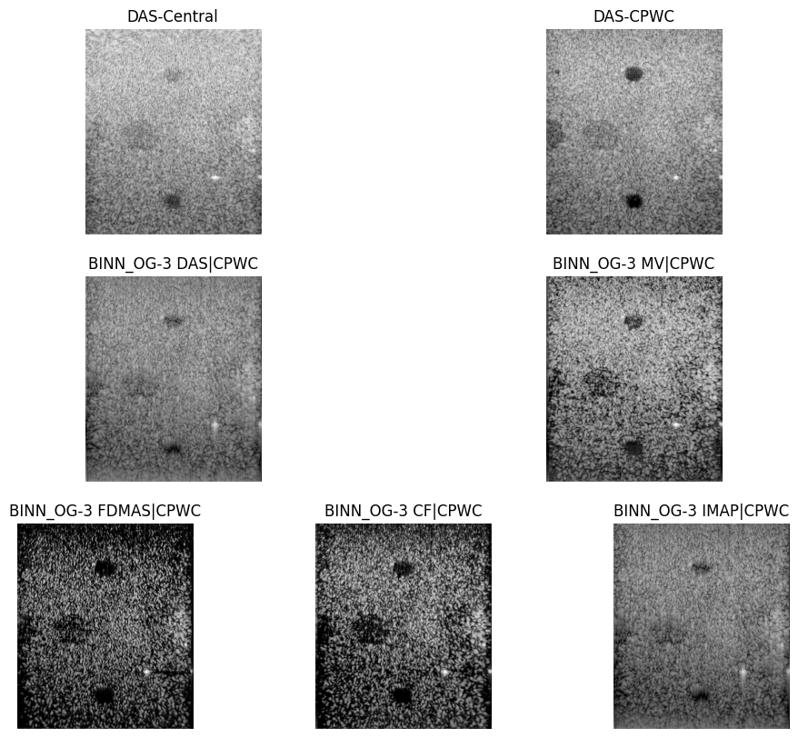

---

# contrast_speckle_expe_dataset_rf: Métricas Contraste

| name                 |      cnr |     gcnr |
|:---------------------|---------:|---------:|
| BINN_OG-3 DAS-CPWC   | 0.084097 | 0.214575 |
| BINN_OG-3 MV-CPWC    | 0.179034 | 0.234413 |
| BINN_OG-3 FDMAS-CPWC | 0.142311 | 0.202834 |
| BINN_OG-3 CF-CPWC    | 0.148376 | 0.260729 |
| BINN_OG-3 IMAP-CPWC  | 0.082930 | 0.217004 |

---

# contrast_speckle_expe_dataset_rf: SSIM

| name                 |     ssim |
|:---------------------|---------:|
| BINN_OG-3 DAS-CPWC   | 0.173811 |
| BINN_OG-3 MV-CPWC    | 0.440758 |
| BINN_OG-3 FDMAS-CPWC | 0.280202 |
| BINN_OG-3 CF-CPWC    | 0.322773 |
| BINN_OG-3 IMAP-CPWC  | 0.181312 |

---

# contrast_speckle_simu_dataset_rf: Models showcase

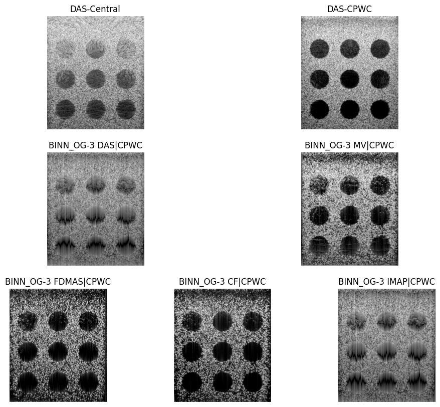

---

# contrast_speckle_simu_dataset_rf: Métricas Contraste

| name                 |      cnr |     gcnr |
|:---------------------|---------:|---------:|
| BINN_OG-3 DAS-CPWC   | 0.190571 | 0.189548 |
| BINN_OG-3 MV-CPWC    | 0.134399 | 0.174312 |
| BINN_OG-3 FDMAS-CPWC | 0.040206 | 0.118938 |
| BINN_OG-3 CF-CPWC    | 0.060199 | 0.188729 |
| BINN_OG-3 IMAP-CPWC  | 0.164318 | 0.172018 |

---

# contrast_speckle_simu_dataset_rf: SSIM

| name                 |     ssim |
|:---------------------|---------:|
| BINN_OG-3 DAS-CPWC   | 0.202192 |
| BINN_OG-3 MV-CPWC    | 0.358028 |
| BINN_OG-3 FDMAS-CPWC | 0.306531 |
| BINN_OG-3 CF-CPWC    | 0.358600 |
| BINN_OG-3 IMAP-CPWC  | 0.212043 |

